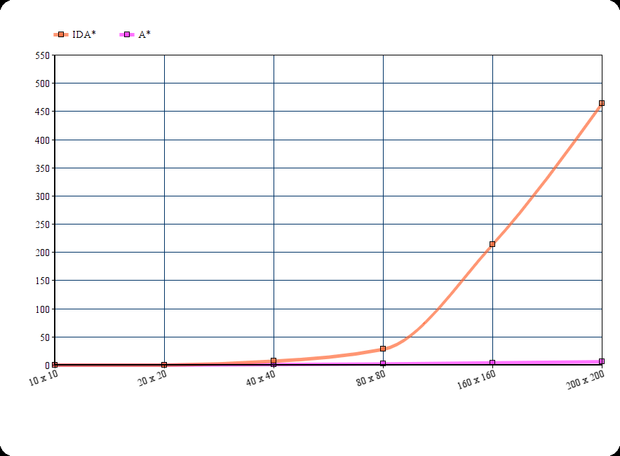

# Testausdokumentti

Ohjelman jokaiselle luokalle on luotu junit testit, jotka varmistavat luokkien oikeanlaisen toiminnan.
Tietorakenteiden kohdalla testataan yksinkertaisesti, että metodien suorittaminen saa aikaan halutun tuloksen.
Polunetsintäalgoritmeja testaamalla tarkistetaan samalla labyrintinluontialgoritmin toimiminnasta, kun varmistetaan että 
labyrintin läpi todella löytyy polku. Lisäksi tarkistetaan, että molemmat polunetsintäalgoritmit päätyvät samaan tulokseen.

Suorituskykytestaukset tehtiin PerformanceTest -luokalla, joka testaa ohjelmassa käytettyjä polunetsintäalgoritmeja eri kokoisilla labyrinteilla. 
Labyrintien maksimikoko on 200x200, jonkä ylittyessä sen rekursiivinen generointialgoritmi lakkaa toimimasta rekursiopinon ylittyessä. Tämän voisi 
estää esimerkiksi pienempiä labyrinttejä yhdistelemällä, mutta tätä ei ole toteutettu harjoitustyössä.

Suorituskykytestauksessa ei erikseen testattu toteutettuja tietorakenteita, sillä niiden toiminta on testattu JUnit testeillä ja aikavaativuudet 
on yksinkertaista nähdä suoraan koodista. Aikavaativuuksia käsitellään toteutusdokumentissa.

